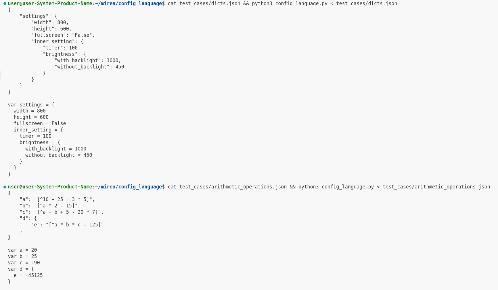

## Config language

### Запуск тестов
```python3 config_language.py```


### Запуск из файла с подробным выводом

```cat test_cases/dicts.json && python3 config_language.py < test_cases/dicts.json```

```cat test_cases/arithmetic_operations.json && python3 config_language.py < test_cases/arithmetic_operations.json```

```cat test_cases/functions.json && python3 config_language.py < test_cases/functions.json```



